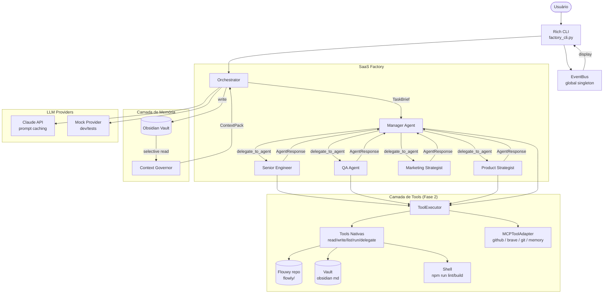

# Arquitetura da SaaS Factory — Fase 2

## Visão Geral



## Componentes Principais

### Orchestrator (`src/orchestrator/manager.py`)
Ponto central de coordenação. Instancia agentes, monta context packs e executa workflows.

```
Orchestrator
├── AgentRegistry      → registro dos 5 agentes com seus ToolExecutors
├── ContextGovernor    → monta AgentContextPack eficiente (max 4096 tokens)
├── MemoryManager      → interface com o vault Obsidian
├── Provider           → LLM selecionado (Claude ou Mock)
└── _setup_agents()    → cria ToolExecutor por role, injeta agent_caller closure
```

Auto-detecção de tools: `enable_tools = provider_name not in ("mock", "base")` — testes com mock provider rodam sem tools automaticamente.

### BaseAgent — Loop Agêntico (`src/core/base_agent.py`)

```
execute(context_pack)
  └─ se tool_executor: _run_agentic_loop(user_message, tools)
  └─ senão: _call_provider(user_message)  ← fallback legado

_run_agentic_loop(user_message, tools, max_tokens=4096):
  messages = [{"role": "user", "content": user_message}]
  for iteration in range(10):
    response = provider.complete_with_tools(system, messages, tools)
    if stop_reason == "end_turn": return text
    if stop_reason == "tool_use":
      for block in tool_use_blocks:
        emit(TOOL_CALL)
        result = tool_executor.execute(block.name, block.input)
        emit(TOOL_RESULT)
        messages.append(tool_result)
```

### EventBus (`src/events.py`)
Singleton pub/sub global. Zero dependências de agentes. CLI subscreve e exibe eventos em tempo real.

```python
EventType: AGENT_START, AGENT_END, TOOL_CALL, TOOL_RESULT, DELEGATION, WORKFLOW_STEP, ERROR, MESSAGE

EventBus.global_bus()  # singleton
bus.subscribe(handler)  # handler(AgentEvent) → None
bus.emit(event)         # silencioso em caso de erro no handler
EventBus.reset()        # para testes
```

### ToolExecutor (`src/tools/executor.py`)
Despacha tool calls com path scoping por role. Previne traversal.

```
execute(tool_name, tool_input) → str
  ├─ read_file        → _resolve_safe(path, allowed_read_root) → open
  ├─ write_file       → _resolve_safe(path, allowed_write_root) → write
  ├─ list_files       → _resolve_safe(dir, allowed_read_root) → listdir
  ├─ run_command      → ALLOWED_COMMANDS[cmd] → subprocess (no shell=True, timeout 120s)
  ├─ delegate_to_agent → agent_caller(role, objective, context) → dict
  └─ *                → mcp_adapter.call_tool(tool_name, tool_input)
```

Segurança: `_resolve_safe` usa `Path.resolve()` para detectar `../` — retorna `PermissionError` antes de qualquer I/O.

### MCPToolAdapter (`src/tools/mcp_adapter.py`)
Conecta a servidores MCP externos via stdio JSON-RPC. Graceful degradation se o pacote não estiver instalado.

```
MCPToolAdapter.start(command, env) → bool  (False = skip, não bloqueia)
MCPToolAdapter.list_tools() → list[dict]   (formato Anthropic)
MCPToolAdapter.call_tool(name, args) → str
MCPToolAdapter.close()

create_mcp_adapters(settings) → dict[str, MCPToolAdapter]
  # inicializa: github, brave-search, sequential-thinking, memory, git
  # usa has_github_mcp / has_brave_mcp das settings
```

### ClaudeProvider — Prompt Caching (`src/providers/claude_provider.py`)

```python
complete_with_tools(system, messages, tools, max_tokens, use_cache=True)
  → self._client.messages.create(model, system=_build_system_param(system), ...)

_build_system_param(system, use_cache=True):
  se prompt_caching AND use_cache AND len(system) >= 1024:
    return [{"type": "text", "text": system, "cache_control": {"type": "ephemeral"}}]
  return system
```

Cache TTL = 5 minutos. ~90% redução de custo em cache hits para o mesmo system prompt.

### Rich CLI (`scripts/factory_cli.py`)
3 modos: `chat` (Manager com tools), `workflow`, `agent`.

```
CLIDisplay subscreve EventBus.global_bus()
  → handle_event(AgentEvent) → atualiza painel Rich

rich.live.Live com 8fps refresh
Cores: Manager=blue, Engineer=green, Product=yellow, QA=red, Marketing=magenta
```

## Context Governance

O `ContextGovernor` monta pacotes de contexto em 5 camadas, por prioridade:

```
1. task   [sempre]     → objetivo, contexto mínimo, critérios (400 tokens)
2. agent  [sempre]     → papel e responsabilidades do agente (200 tokens)
3. project [quando]    → visão, status, PRD vigente (500 tokens)
4. memory  [quando]    → notas relevantes do vault via memory_hints (600 tokens)
5. global  [se couber] → princípios gerais (300 tokens)
```

Token budget padrão: **4.096 tokens por chamada**.

## Políticas de Contexto (depth)

| Depth | Tokens | Quando usar |
|-------|--------|-------------|
| `short` | 512–768 | Triagem, confirmações, resumos executivos |
| `medium` | 1.024–2.048 | Planos, análises, reviews |
| `deep` | 2.048–4.096 | PRD completo, implementação, arquitetura detalhada |

## Estrutura de Memória

### Memória Canônica (permanente)
- PRDs versionados
- Decisões (ADRs)
- Planos técnicos aprovados
- Planos de marketing aprovados

### Memória Operacional (descartável)
- Logs de execução
- Snapshots intermediários
- Rascunhos não aprovados

## Como Importar Sem Circulares

```
Orchestrator (conhece agentes)
  └─ cria closure _agent_caller (captura self — sem import de tipo externo)
  └─ passa Callable[[str,str,str], Awaitable[dict]] para ToolExecutor e ManagerAgent
  └─ ToolExecutor.execute("delegate_to_agent", ...) → chama agent_caller(...)
  └─ closure → self.run_task(...) no Orchestrator

ToolExecutor NÃO importa src/agents/ nem src/orchestrator/
EventBus NÃO importa nenhum agente
```

## Extensibilidade

### Adicionar novo agente
1. Criar `src/agents/novo_agent.py` herdando de `BaseAgent`
2. Adicionar role em `AgentRole` enum (`src/schemas/task.py`)
3. Criar prompt em `src/prompts/novo.md`
4. Adicionar tools em `src/tools/definitions.py`
5. Registrar em `Orchestrator._setup_agents()` com `_make_executor(role)`

### Adicionar novo provider
1. Criar `src/providers/novo_provider.py` herdando de `BaseLLMProvider`
2. Implementar `complete()` e `complete_with_tools()`
3. Adicionar caso em `src/providers/factory.py`

### Adicionar novo workflow
1. Criar `src/workflows/novo_workflow.py`
2. Definir lista de `steps` com `agent`, `objective`, `depth`, `acceptance_criteria`
3. Chamar `orchestrator.run_workflow()`
4. Registrar no CLI em `scripts/factory_cli.py`
