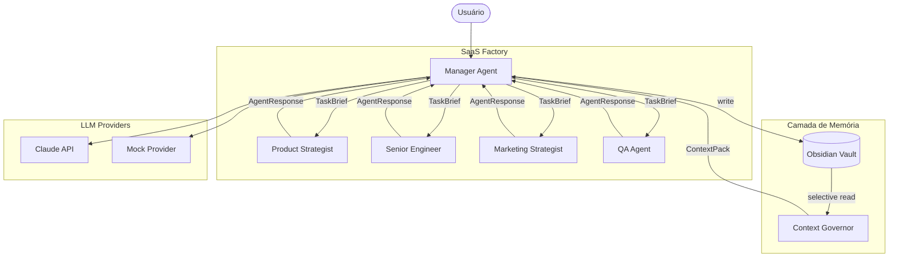

# Arquitetura da SaaS Factory

## Visão Geral



## Componentes Principais

### Orchestrator
Ponto central de coordenação. Instancia agentes, monta context packs e executa workflows.

```
Orchestrator
├── AgentRegistry      → registro dos 5 agentes
├── ContextGovernor    → monta AgentContextPack eficiente
├── MemoryManager      → interface com o vault
└── Provider           → LLM selecionado
```

### Context Governance

O `ContextGovernor` monta pacotes de contexto em 5 camadas, por prioridade:

```
1. task   [sempre]   → objetivo, contexto mínimo, critérios
2. agent  [sempre]   → papel e responsabilidades do agente
3. project [quando]  → visão, status, PRD vigente
4. memory  [quando]  → notas relevantes do vault (seletivo)
5. global  [se couber] → princípios e convenções gerais
```

Token budget padrão: **4.096 tokens por chamada**.
Manager controla que cada agente receba apenas o necessário.

### Fluxo de Dados

```
User Input
    ↓
Manager interpreta intenção
    ↓
Context Governor monta ContextPack mínimo
    ↓
Agente executa com seu system prompt + ContextPack
    ↓
AgentResponse retorna ao Manager
    ↓
Manager consolida + persiste memória no vault
    ↓
Output ao usuário
```

## Políticas de Contexto

### Quando usar `short` (512-768 tokens)
- Confirmações e resumos executivos
- Planejamento inicial de alto nível
- Triagem de feedback

### Quando usar `medium` (1.024-2.048 tokens)
- Geração de planos e análises
- Reviews de artefatos
- Iterações de produto

### Quando usar `deep` (2.048-4.096 tokens)
- PRD completo
- Arquitetura detalhada
- Auditoria completa

## Estrutura de Memória

### Memória Canônica (permanente)
- PRDs versionados
- Decisões (ADRs)
- Planos técnicos aprovados
- Planos de marketing aprovados

### Memória Operacional (descartável)
- Logs de execução
- Snapshots intermediários
- Rascunhos não aprovados

### Recuperação Seletiva
O Manager usa `memory_hints` (slugs de notas) para recuperar apenas o que é relevante para a tarefa atual. Nunca carrega o vault inteiro.

## Extensibilidade

### Adicionar novo agente
1. Criar classe em `src/agents/novo_agent.py` herdando de `BaseAgent`
2. Adicionar role em `AgentRole` enum
3. Criar prompt em `src/prompts/novo.md`
4. Registrar em `Orchestrator._setup_agents()`

### Adicionar novo provider
1. Criar classe em `src/providers/novo_provider.py` herdando de `BaseLLMProvider`
2. Adicionar caso em `src/providers/factory.py`

### Adicionar novo workflow
1. Criar função em `src/workflows/novo_workflow.py`
2. Definir lista de `steps` com agent, objective, depth
3. Chamar `orchestrator.run_workflow()`
